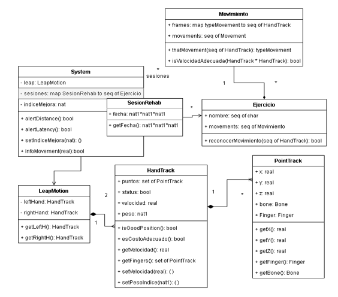
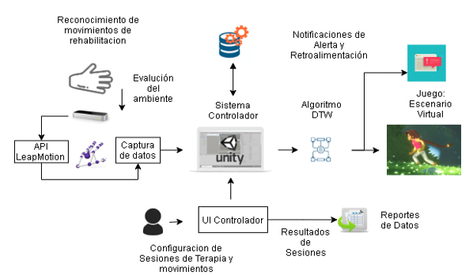
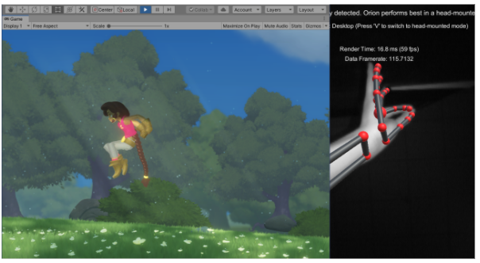

# Sistema Controlador para Rehabilitación en motor fino

_Sistema Controlador de tracking óptico de bajo costo tiene el objetivo de complementar la rehabilitación orientada a motor fino, facilitando la fiabilidad de la captura de movimientos del dispositivo Leap Motion y obtener una retroalimentación sobre la exactitud de los ejercicios._

## VDM++ - Definicion de Requisitos 📋

**VDM++** consiste en un grupo de lenguajes matemáticamente bien fundamentados y herramientas para expresar y analizar modelos de sistemas durante las primeras etapas de diseño. La construcción y el análisis del modelo ayudan a identificar áreas de incompletitud o ambigüedad en las especificaciones realizadas en lenguaje natural

Ademas en este trabajo se utilizo VDMToolBox la cual es una caja de herramientas con todas las funciones para la familia VDM con una larga historia. Tiene IDE con GUI y herramientas de línea de comandos con características que incluyen verificadores de sintaxis, verificadores de tipo, intérpretes, generadores de obligación de prueba y generadores de código. Puede encontrarse mayour informacion en [1] o descargarse directamente de [2]

El diseño de clases para las especificaciones es el siguiente: 

## Arquitectura

Se definen 5 modulos: El primer módulo es el de captura de datos, y es en donde se evalúa si el usuario está a un buen alcance, también se consideran la latencia y temas de iluminación. El segundo módulo es el controlador que recibirá esta información la almacenara y conforme a las configuraciones de sesiones de rehabilitación o movimientos emitirá reportes de datos, así mismo estará integrado con el tercer módulo que contendrá el algoritmo DTW (Dynamic Time Warping) [3] para evaluar el grado de similitud de los movimientos con otros previamente grabados. Con ello se emitirán notificaciones de retroalimentación y error al usuario. Finalmente contará con un distractor y motivador durante el periodo de rehabilitación, es por ello que se considera un último módulo para escenarios virtuales el cual pueda ofrecer un entorno de juego al paciente

## Prototipo - Juego ⚙️

Este prototipo fue desarrollado en unity: A partir de un conjunto de assets LostCrypt de Unity Assets Store [4] se definio la base del juego y posteriormente se incorporaton los paquetes correspondientes de Leap Motion[5], finalmente se programaron los eventos.

## Autores ✒️

* **Edwin Enrique Saavedra Parisaca** - *Trabajo Inicial* - [linked](https://www.linkedin.com/in/edwin-saavedra-a9538a1a1/)
* **Elizabeth Vidal Duarte* - [linked](https://www.linkedin.com/in/elizabeth-vidal-duarte/)

## Referencias 📖

[1] Overture Tool, Formal Modeling in VDM. [Online] Available: https://www.overturetool.org/publications/books/vdmtools.html
[2] FMVDM, VDMTOOLS. [Online] Available: http://fmvdm.org/vdmtools/index.html
[3] P. Senin, “Dynamic time warping algorithm review”. Information and Computer Science Department University of Hawaii at Manoa Honolulu, USA, vol. 855. pp. 1-23, 2008.
[4] Unity Assets 2D project: Lost Crypt, [Online] Available: https://blogs.unity3d.com/2019/12/18/download-our-new-2d-sample-project-lost-crypt/?_ga=2.198153711.1756286399.1617779673-538258448.1584847703
[5] Ultraleap, “Leap Motion Developer”, 2013. [Online]. Available: https://developer.leapmotion.com/